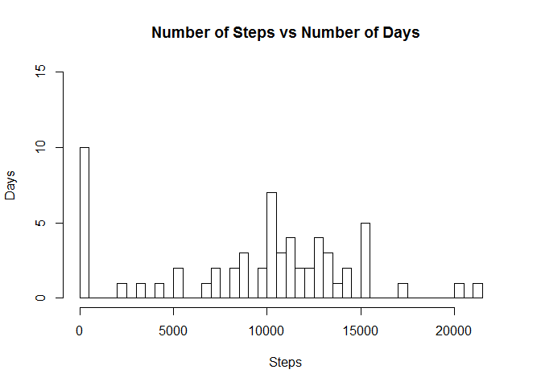
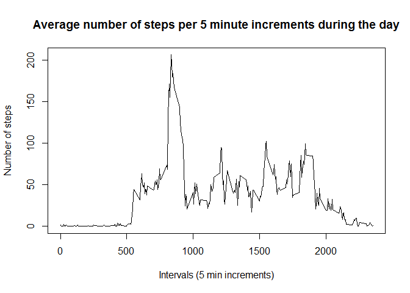
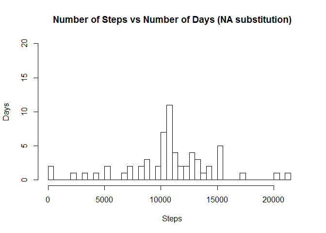
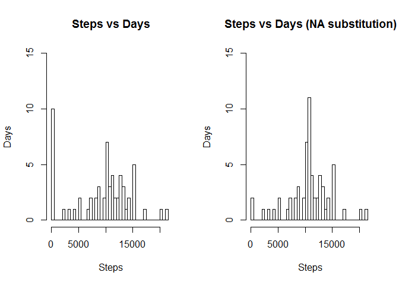
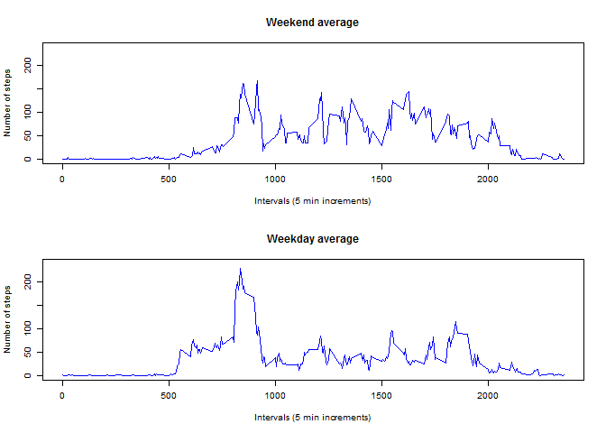

# PA1_template


## Peer-graded Assignment: Course Project 1

We are asked to answer a few questions from a database from a personal activity 
monitoring device.The variables included in this dataset are:
steps: Number of steps taking in a 5-minute interval (missing values are coded as NA)
date: The date on which the measurement was taken in YYYY-MM-DD format
interval: Identifier for the 5-minute interval in which measurement was taken.
The dataset is stored in a comma-separated-value (CSV) file and there are a 
total of 17,568 observations in this dataset.


Read the file:

```r
act <- read.csv("activity.csv")
```


################################################################################

## QUESTION 1

What is mean total number of steps taken per day?


```r
## aggregate to get total steps per day
totStepsDay <- aggregate(act$steps, list(act$date),sum, na.rm = TRUE)
names(totStepsDay) <- c("date", "TStepsDay")
paste("mean =", round(mean(totStepsDay$TStepsDay, na.rm = TRUE),2))
```

```
## [1] "mean = 9354.23"
```


For this part of the assignment, you can ignore the missing values in the 
dataset.
Make a histogram of the total number of steps taken each day.

```r
## check distribution with histogram - most are between 10 and 15k per day
hist(totStepsDay$TStepsDay, main = "Number of Steps vs Number of Days", 
     breaks = 61, xlab = "Steps", ylab = "Days", ylim = c(0,15),
     xlim = c(0,22000))
```

<!-- -->

Calculate and report the mean and median of the total number of steps taken per 
day.

```r
paste("mean =", round(mean(totStepsDay$TStepsDay, na.rm = TRUE),2))
```

```
## [1] "mean = 9354.23"
```

```r
paste("median =", round(median(totStepsDay$TStepsDay, na.rm = TRUE),2))
```

```
## [1] "median = 10395"
```

###############################################################################

## QUESTION 2

What is the average daily activity pattern?
Make a time series plot (i.e. type = "l) of the 5-minute interval (x-axis) 
and the average number of steps taken, averaged across all days (y-axis).
Which 5-minute interval, on average across all the days in the dataset 
contains the maximum number of steps?


```r
## modifying db using new db called act2
act2 <- act

## change interval to factor to aggregate
act2$interval <- factor(act2$interval)

totStepsInt <- aggregate(act2$steps, list(act2$interval), mean,na.rm = TRUE)
names(totStepsInt) <- c("interval", "TSteps")

## change interval back to numeric to time plot
totStepsInt$interval <- as.numeric(as.character(totStepsInt$interval))
plot(totStepsInt$interval,totStepsInt$TSteps, type = "l", 
     xlab =  "Intervals (5 min increments)", ylab = "Number of steps", 
     main = "Average number of steps per 5 minute increments during the day")
```

<!-- -->

Which 5-minute interval, on average across all the days in the dataset 
contains the maximum number of steps?


```r
paste("5 min interval with maximum steps occurs between", 
      totStepsInt$interval[which(totStepsInt$TSteps == 
                                         max(totStepsInt$TSteps))],
"and",totStepsInt$interval[which(totStepsInt$TSteps == 
                                         max(totStepsInt$TSteps))]+5,
"minute interval.")
```

```
## [1] "5 min interval with maximum steps occurs between 835 and 840 minute interval."
```

################################################################################

## QUESTION 3

Imputing missing values
Note that there are a number of days/intervals where there are missing values
(coded as NA). The presence of missing days may introduce bias into some
calculations or summaries of the data.


Calculate and report the total number of missing values in the dataset
(i.e. the total number of rows with NAs)

```r
## modifying db using new db called act3
act3 <- act
## check the columns for missing values
c(sum(is.na(act3$steps)),sum(is.na(act3$date)),
                                         sum(is.na(act3$interval)))
```

```
## [1] 2304    0    0
```


NAs are in steps column only. 2304 rows with NAs.


Devise a strategy for filling in all of the missing values in the dataset.
The strategy does not need to be sophisticated. For example,
you could use the mean/median for that day, or the mean for that 5-minute
interval, etc.
Create a new dataset that is equal to the original dataset but with the
missing data filled in.

Strategy for NAs -> substitute them with the mean for that 5 minute interval


```r
## Create logical vector with the NA row indices
NArows <- is.na(act3$steps)
## merge act3 with the mean interval data frame totStepsInt (by interval)
act3Merged <-merge(act3, totStepsInt, by = "interval")
## sort by date then by interval to keep same order as original 
act3Sorted <- act3Merged[order(act3Merged$date, act3Merged$interval),]
## fill in NArows in steps with mean of that interval
for(i in 1:nrow(act3Sorted)){
        if (NArows[i]){
                act3Sorted$steps[i] <- act3Sorted$TSteps[i] 
                
        }
}
## checked random lines all NAs are gone and substituted 
# with the mean of the interval
##### Cosmetic changes -  make it look like original #######
## get rid of the mean interval column 
newAct <- act3Sorted[,c(-4)]
## round steps column and change to integer type
newAct$steps <- round(newAct$steps)
newAct$steps <- as.integer(newAct$steps)
## reorder columns to match original
newAct <- newAct[,c("steps","date", "interval")]
```

Make a histogram of the total number of steps taken each day and Calculate
and report the mean and median total number of steps taken per day.

```r
## aggregate to get total steps per day
totStepsDayClean <- aggregate(newAct$steps, list(newAct$date),sum, 
                              na.rm = TRUE)
names(totStepsDayClean) <- c("date", "TStepsDayClean")
## check distribution with histogram - most are between 10 and 15k per day
hist(totStepsDayClean$TStepsDayClean, 
     main = "Number of Steps vs Number of Days (NA substitution)", 
     breaks = 61, xlab = "Steps", ylab = "Days", ylim = c(0,20),
     xlim = c(0,22000))
```

<!-- -->


```r
paste("mean =", round(mean(totStepsDayClean$TStepsDayClean, na.rm = TRUE),2))
```

```
## [1] "mean = 10765.64"
```

```r
paste("median =", round(median(totStepsDayClean$TStepsDayClean, 
                               na.rm = TRUE),2))
```

```
## [1] "median = 10762"
```

Do these values differ from the estimates from the first part of the
assignment? What is the impact of imputing missing data on the estimates
of the total daily number of steps?

```r
par(mfrow=c(1,2))
hist(totStepsDay$TStepsDay, main = "Steps vs Days", 
     breaks = 61, xlab = "Steps", ylab = "Days", ylim = c(0,15),
     xlim = c(0,22000))
hist(totStepsDayClean$TStepsDayClean, main = "Steps vs Days (NA substitution)", 
     breaks = 61, xlab = "Steps", ylab = "Days", ylim = c(0,15),
     xlim = c(0,22000))
```

<!-- -->

NA value substitution contributes to the mean. 
It also cut down on zero values as many NA's were on dates that had zero values 
as well.

################################################################################

## QUESTION 4

Are there differences in activity patterns between weekdays and weekends?
For this part the weekdays() function may be of some help here.
Use the dataset with the filled-in missing values for this part.
Create a new factor variable in the dataset with two levels - "weekday"
and "weekend" indicating whether a given date is a weekday or weekend day.


```r
# Will modify no NA df newAct
newAct2 <- newAct
## change date to Date type to use weekday() function
newAct2$date <- as.Date(newAct2$date,format = "%Y-%m-%d")
## create day of week column
newAct2$DayofWeek <- weekdays(newAct2$date)
## create empty weekend weekday column
newAct2$dayType <- "0"
## fill it up
for(i in 1:nrow(newAct2)){
        if(newAct2$DayofWeek[i] == "Saturday" || newAct2$DayofWeek[i] == 
           "Sunday")
          {
                newAct2$dayType[i] = "weekend"
        }
        else{
                newAct2$dayType[i] = "weekday"
        }
}
## make weekday column a factor type -- weekday = 1 weekend = 2
newAct2$dayType <- as.factor(newAct2$dayType)
```

Make a panel plot containing a time series plot (i.e. type = "l")
of the 5-minute interval (x-axis) and the average number of steps taken,
averaged across all weekday days or weekend days (y-axis).

```r
byDayType <- aggregate(newAct2$steps, list(newAct2$dayType,newAct2$interval), 
                       mean, na.rm = TRUE)
names(byDayType) <- c("dayType", "interval", "steps")
## round steps
byDayType$steps <- round(byDayType$steps)
## subset weekend info
byWeekend <- byDayType[byDayType$dayType == "weekend", ]
## subset week info
byWeekday <- byDayType[byDayType$dayType == "weekday",]
par(mfrow=c(2,1), cex=.6)
plot(byWeekend$interval,byWeekend$steps, type = "l", 
     xlab =  "Intervals (5 min increments)", ylab = "Number of steps", 
     main = "Weekend average", ylim = c(0,240), col = "blue")
plot(byWeekday$interval,byWeekday$steps, type = "l", 
     xlab =  "Intervals (5 min increments)", ylab = "Number of steps", 
     main = "Weekday average", ylim = c(0,240), col = "blue")
```

<!-- -->


